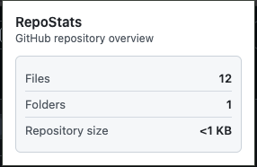

# github-stats-extension


RepoStats is a lightweight Chrome extension that gives you a quick snapshot of a GitHub repository - **file count, folder count, and repository size** - directly from the extension popup.

---

## What it does

When you open a GitHub repository and click the extension icon, RepoStats:

- Reads the current repository from the active tab
- Fetches repository metadata from the GitHub public API
- Analyzes the repository structure
- Displays:
  - Total number of files
  - Total number of folders
  - Repository size

For very large repositories, GitHub may return partial results.

---


## Limitations

- Works only with **public GitHub repositories**
- Private or inaccessible repositories cannot be analyzed
- Very large repositories may return **partial file/folder counts** due to GitHub API limitations

---

## API Used

RepoStats uses the **GitHub REST API (public endpoints)** to fetch repository data.

Endpoints used:
- `GET /repos/{owner}/{repo}`  
  Used to fetch repository metadata such as default branch and repository size.

- `GET /repos/{owner}/{repo}/git/trees/{branch}?recursive=1`  
  Used to retrieve the repository tree structure and calculate file and folder counts.

All requests are made **without authentication** and work only for public repositories.

---

## Screenshots

### Popup UI
> Quick overview of repository stats from the extension popup.



---

### Data Flow 
> High-level flow between popup UI and background service worker.


---

## Development

```bash
bun install
bun run build
```